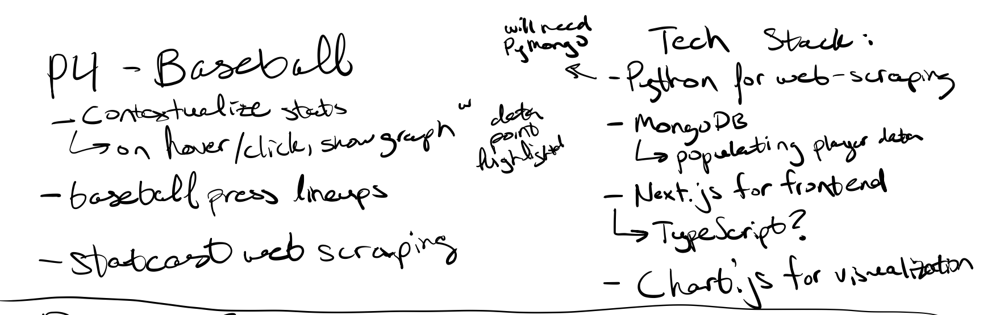
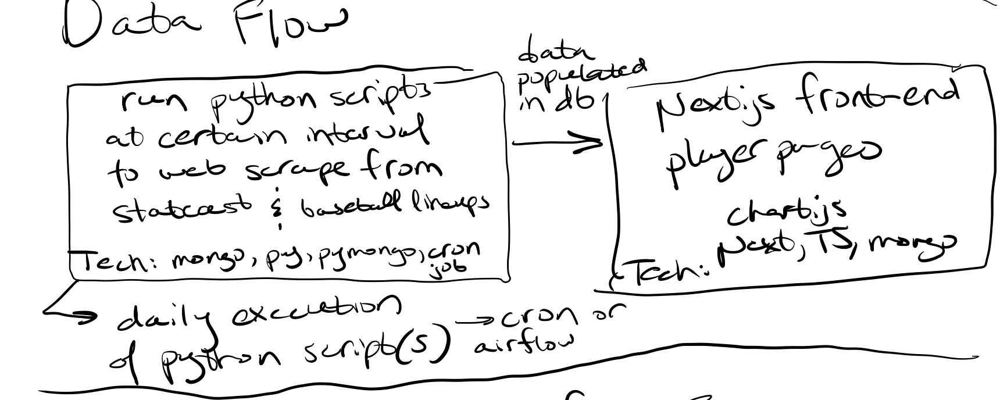
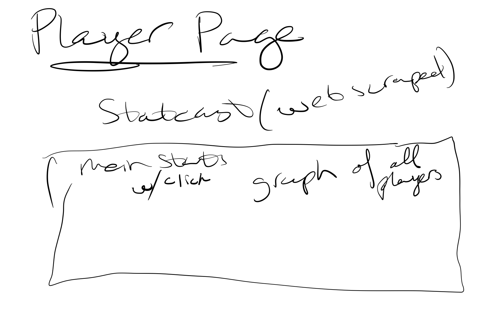
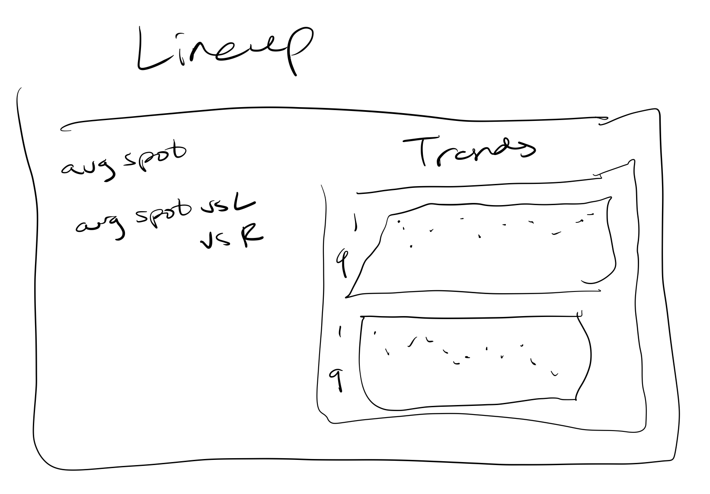
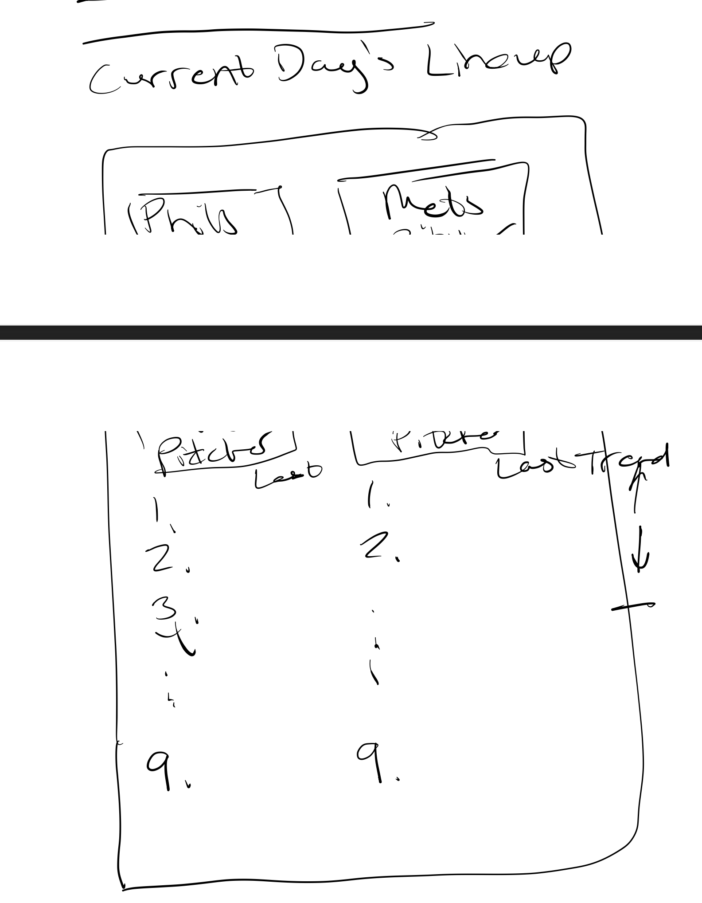
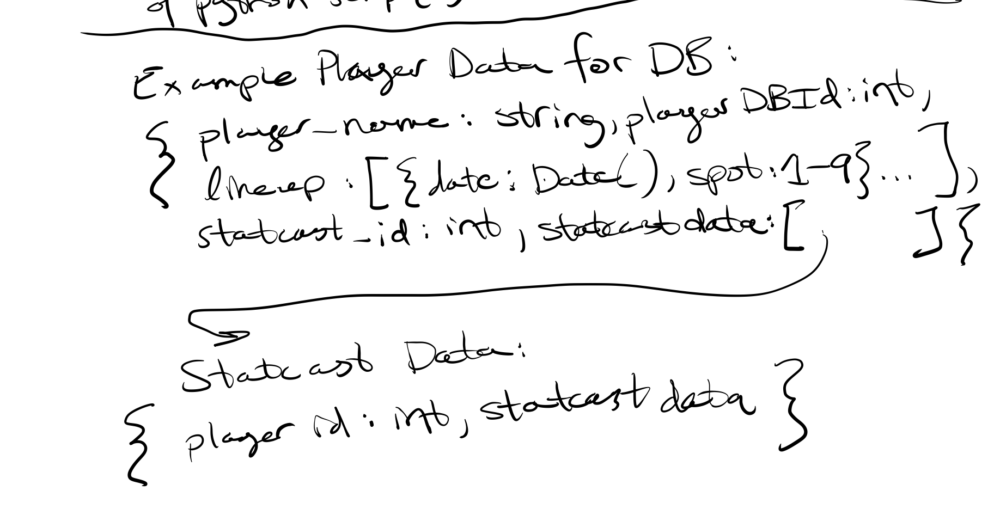

# Velo-on-Exit

## Introduction

## Tech Stack
Python for web scraping Statcast and Baseball-Press. Cron-job or Airflow for scheduled script execution. PyMongo and MongoDB to populate the database.
Next.js and possibly TypeScript for the front-end.

## Wireframes

## ROUGH ERD

