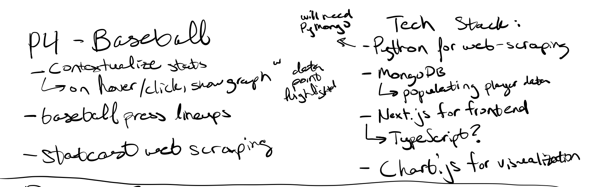
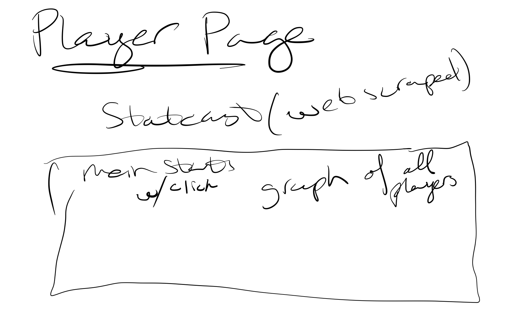
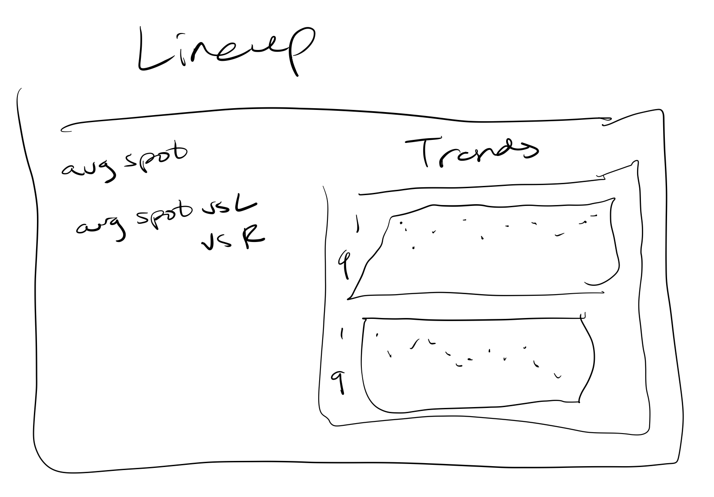
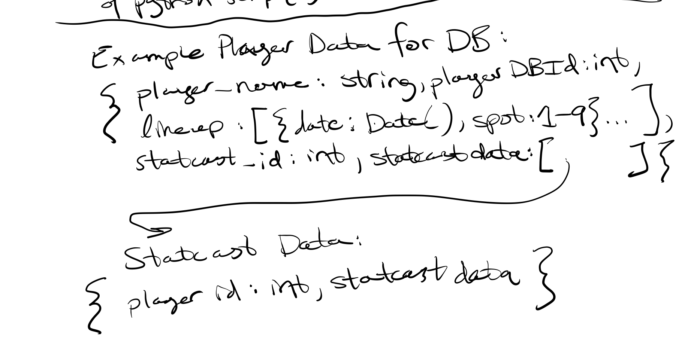

# Velo-on-Exit

## Introduction

## Tech Stack

Python for web scraping Statcast and Baseball-Press. Cron-job or Airflow for scheduled script execution. Send data from web scraping as CSV or JSON to JS back-end.
MongoDb and Mongoose for JS back-end.
Next.js and possibly TypeScript for the front-end.

## Wireframes

## ROUGH ERD

## RESTFUL ROUTING

| HTTP VERB | ROUTE                | ACTION | USED FOR                                           |
| --------- | -------------------- | ------ | -------------------------------------------------- |
| GET       | '/players'           | index  | access search page to find player and leaderboard? |
| GET       | '/players/:playerid' | index  | access player page                                 |
| GET       | '/games/:gameid      | index  | access game lineup                                 |
| POST      | '/games/'            | create | add game to database                               |

## MVP

- Scrape data from lineup website
- Add lineup data to back-end
- Player stats page with graph(s) and table(s)

## Stretch

- Automate scraping (CronTab?)
- Interactive player pages
- Client written in TypeScript

## Planning

- Day 1

  - Get basic webscraping of lineup page from baseballpress done
  - Populate test data into MongoDB

- Day 2

  - Start front end development
  - Start player page development

- Day 3

  - Research airflow and cron job to schedule python script execution
  - Continue front end development

- Day 4

  - Finish python and db scripts and execution
  - Continue front end development

- Day 5 and on

  - Bug fixes
  - Complete front end development
